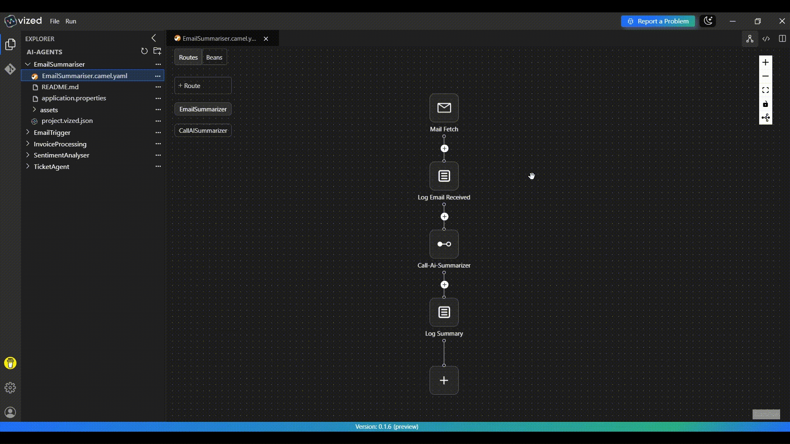

# Email Summarizer with VIZED & Apache Camel

## What is Email Summarization?

Email Summarization simplifies email management by automatically generating concise summaries of email content. This helps users quickly understand the main points of an email without reading the entire message, improving productivity and efficiency.

## Overview

This tutorial demonstrates how to implement **Email Summarization** using **VIZED** and **Apache Camel**. You'll learn how to create a system that monitors an email inbox, analyzes the content of each email using an AI, and generates a summary.

## Key Features

- **Email Integration**: Automatically fetch emails from an inbox.
- **AI-Powered Summarization**: Use AI to generate concise summaries of email content.
- **Logging**: Log the received emails and their generated summaries for monitoring.

## System Architecture

The solution uses Apache Camel's integration framework with the following components:
- **Gmail IMAP**: Source of emails via IMAP.
- **Apache Camel**: Integration and routing engine.
- **OpenRouter/OpenAI API**: Natural language processing for email summarization.

## Step-by-Step Implementation Guide

### 1. Create a New Integration Project

Begin by setting up your project workspace in VIZED:

1. Navigate to the Workspace view.
2. Create a new Integration Project.

### 2. Configure Your Source Component

Set up the entry point for your integration flow:

1. Click the "Add Route" button in the visual designer.
2. Search for the IMAP Component in the Component tab.
3. Configure it to monitor your email inbox.

### 3. Implement AI-Powered Summarization

Use an AI to analyze the email content and generate a summary:

1. Add a `direct:call-ai-summarizer` component to call the AI service.
2. Configure the AI to summarize the email content in a few sentences.

### 4. Log Summaries

Log the received emails and their generated summaries for monitoring:

1. Add a `log` step to log the email content.
2. Add another `log` step to log the generated summary.

## Running the Integration Project

1. Select your integration project in VIZED.
2. Right-click on the Camel file and select "Run" from the context menu.
3. Monitor the logs to see emails being processed and summaries being generated.

## External Dependencies Setup

### 1. Gmail IMAP

To receive messages from Gmail, you need to configure access:

1. **Enable IMAP in Gmail**:
   - Go to Gmail settings -> Forwarding and POP/IMAP.
   - Enable IMAP access.

2. **Generate an App Password (if using 2-Factor Authentication)**:
   - Go to your Google Account -> Security.
   - Enable 2-Step Verification.
   - Create an App Password for the application.

### 2. LLM API (or Alternative LLM Service)

For email summarization, you need to set up an LLM API:

1. **Create an OpenAI Account** or **OpenRouter Account**:
   - Register at [OpenAI Platform](https://platform.openai.com/signup) or [OpenRouter](https://openrouter.ai/signup).

2. **Generate API Key**:
   - Navigate to API Keys in your OpenAI or OpenRouter dashboard.
   - Create a new secret key.

3. **Select a Model**:
   - Recommended: gpt-4 or gpt-3.5-turbo (OpenAI), qwen/qwen3-1.7b:free (OpenRouter).
   - The prompt is designed to work with ChatGPT-style models.

## Need Help?

We're here to assist you with any questions or issues you may face. Whether you're stuck, confused, or simply need some guidance, we're just a click away!

> **Oops! Bugs happen.** Let us know so we can resolve them quickly. Your feedback is invaluable in helping us improve.

For more examples >> [click here](/examples/README.md)

## Contact us

