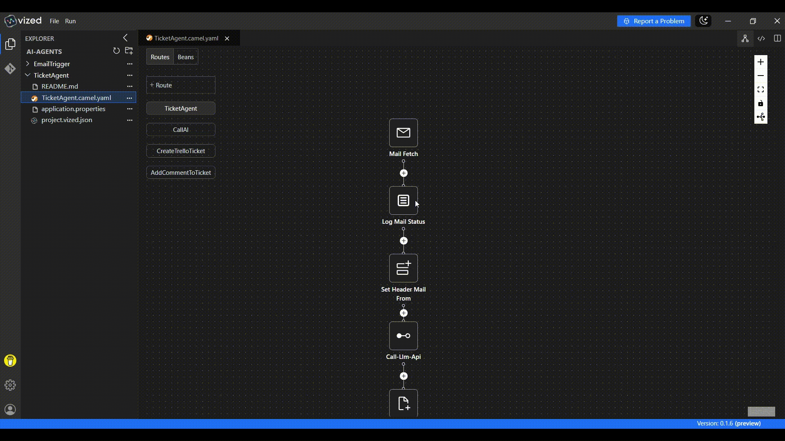

# Automated Ticket Management with VIZED & Apache Camel

## What is Automated Ticket Management?

Automated Ticket Management streamlines customer support by automatically creating and updating tickets based on incoming communications. This ensures that all inquiries are tracked and addressed efficiently, improving response times and customer satisfaction.

## Overview

This tutorial demonstrates how to implement **Automated Ticket Management** using **VIZED** and **Apache Camel**. You'll learn how to create a system that monitors an email inbox, analyzes the content of each email using an AI, and automatically creates or updates tickets in Trello.

## Key Features

- **Email Integration**: Automatically process incoming emails.
- **AI-Powered Analysis**: Use AI to understand the content and intent of emails.
- **Trello Integration**: Create and update Trello tickets for efficient tracking.
- **Customer Conversation Tracking**: Maintain context by adding new emails as comments to existing tickets.

## System Architecture

The solution uses Apache Camel's integration framework with the following components:
- **Gmail IMAP**: Source of customer emails via IMAP
- **Apache Camel**: Integration and routing engine
- **OpenRouter/OpenAI API**: Natural language analysis for ticket categorization
- **Trello API**: Ticket creation and management
- **Caffeine Cache**: In-memory storage for tracking active tickets

## Step-by-Step Implementation Guide

### 1. Create a New Integration Project

Begin by setting up your project workspace in VIZED:

1.  Navigate to the Workspace view.
2.  Create a new Integration Project for your routing solution.

### 2. Configure Your Source Component

Set up the entry point for your integration flow:

1.  Click the "Add Route" button in the visual designer.
2.  Search for the IMAP Component in the Component tab.
3.  Configure it to monitor your email inbox.

### 3. Implement AI-Powered Analysis

Use an AI to analyze the email content and extract relevant information:

1.  Add a `direct:call-llm-api` component to call the AI service.
2.  Configure the AI to extract intent, mood, urgency, and severity from the email.

### 4. Create or Update Trello Tickets

Create new tickets or add comments to existing ones based on the email content:

1.  Add a Choice processor to determine if a ticket already exists for the customer.
2.  If a ticket exists, add a comment to it.
3.  If a ticket does not exist, create a new Trello ticket.
4.  Configure Caffeine Cache to store and retrieve ticket IDs based on customer email.

<!-- ### 5. Configure Caffeine Cache

Use Caffeine Cache to track active tickets:

1.  Configure Caffeine Cache to store and retrieve ticket IDs based on customer email.
2.  Set an appropriate expiry time for the cache entries. -->

## Running the Integration Project

1.  Select your integration project in VIZED.
2.  Right-click on the Camel file and select "Run" from the context menu.
3.  Monitor the logs to see emails being processed and tickets being created or updated in Trello.

## External Dependencies Setup

### 1. Gmail IMAP

To receive messages from Gmail, you need to configure access:

1.  **Enable IMAP in Gmail**:
    *   Go to Gmail settings -> Forwarding and POP/IMAP
    *   Enable IMAP access

2.  **Generate an App Password (if using 2-Factor Authentication)**:
    *   Go to your Google Account -> Security
    *   Enable 2-Step Verification
    *   Create an App Password for the application

### 2. Trello Integration

To create and update support tickets, you need to set up Trello:

1. **Create a Trello Account**:
   - Register at [Trello.com](https://trello.com/signup) if you don't have an account

2. **Generate API Credentials**:
   - Go to [https://trello.com/power-ups/admin](https://trello.com/power-ups/admin)
   - Note your API Key
   - Generate a Token with appropriate permissions

3. **Create Board Structure**:
   - Create a board for support tickets
   - Create lists for ticket states (e.g., "New", "In Progress", "Resolved")
   - Consider adding custom labels (e.g., "urgent", "customer-upset") for better organization

4. **Get Board and List IDs**:
   - Board ID: Found in the URL when viewing the board (`https://api.trello.com/1/members/me/boards`)
   - List ID: Use one of these methods:
        - Use the Trello API Explorer at [https://developer.atlassian.com/cloud/trello/rest](https://developer.atlassian.com/cloud/trello/rest)
        - Call `https://api.trello.com/1/boards/{boardId}/lists?key={yourKey}&token={yourToken}`

### 3. LLM API (or Alternative LLM Service)

For message analysis, you need to set up an LLM API:

1. **Create an OpenAI Account** or **OpenRouter Account**:
   - Register at [OpenAI Platform](https://platform.openai.com/signup) or [OpenRouter](https://openrouter.ai/signup)

2. **Generate API Key**:
   - Navigate to API Keys in your OpenAI or OpenRouter dashboard
   - Create a new secret key

3. **Select a Model**:
   - Recommended: gpt-4 or gpt-3.5-turbo (OpenAI), qwen/qwen3-1.7b:free (OpenRouter)
   - The prompt is designed to work with ChatGPT-style models

## Need Help?

We're here to assist you with any questions or issues you may face. Whether you're stuck, confused, or simply need some guidance, we're just a click away!

> **Oops! Bugs happen.** Let us know so we can resolve them quickly. Your feedback is invaluable in helping us improve.

For more examples >> [click here](/examples/README.md)

## Contact us

