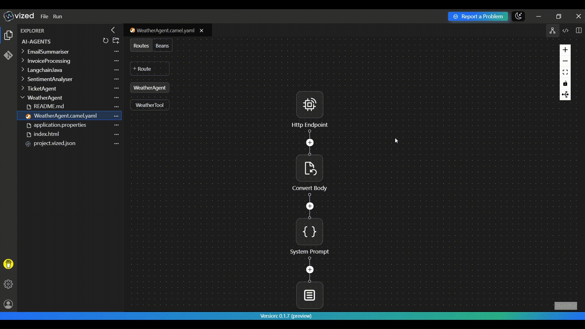

# Weather AI Agent with with VIZED & Apache Camel

## What is a Weather AI Agent?

A Weather AI Agent is an intelligent assistant that understands natural language queries about weather conditions and automatically fetches real-time weather data for any location. It combines the power of Large Language Models (LLMs) with external weather APIs to provide conversational weather information.

## Overview

This tutorial demonstrates how to implement a **Weather AI Agent** using **VIZED** and **Apache Camel**. You'll learn how to create a system that accepts natural language weather queries via HTTP, processes them using AI with tool integration, and returns intelligent weather responses by fetching real-time data from weather APIs.

## Key Features

- **Natural Language Processing**: Ask weather questions in plain English
- **Real-time Weather Data**: Fetches current weather information from Open-Meteo API
- **Multiple LLM Support**: Configured for both Ollama and Google Gemini models
- **Tool Integration**: Demonstrates LangChain4j tool usage with Apache Camel
- **RESTful Interface**: Simple HTTP POST endpoint for weather queries

## System Architecture
The solution uses Apache Camel's integration framework with the following components:
- **HTTP Endpoint**: Accepts weather queries via HTTP POST requests
- **Apache Camel**: Integration and routing engine with LangChain4j integration
- **Ollama**: Large Language Models for natural language understanding
- **Open-Meteo API**: Weather data provider

```
┌─────────────────┐    ┌─────────────────┐     ┌─────────────────┐
│   HTTP Client   │───▶│ Weather Agent   │───▶│ LLM with Tools  │
│                 │    │ (Camel Route)   │     │ (LangChain4j)   │
└─────────────────┘    └─────────────────┘     └─────────────────┘
                                                        │
                                                        ▼
                                             ┌─────────────────┐    ┌─────────────────┐
                                             │ Weather Tool    │    │ Weather APIs    │
                                             │ Consumer        │───▶│ (Open-Meteo)    │
                                             └─────────────────┘    └─────────────────┘
```


## Step-by-Step Implementation Guide

### 1. Create a New Integration Project

Begin by setting up your project workspace in VIZED:

1.  Navigate to the Workspace view.
2.  Create a new Integration Project for your routing solution.

### 2. Configure Your Source Component

Set up the entry point for your integration flow:

1. Click the "Add Route" button in the visual designer.
2. Search for the Platform HTTP Component in the Component tab.
3. Configure it to accept POST requests on the `/chat` endpoint.



### 3. Integrate LLM with tools

Use LangChain4j integration to process natural language queries:

1. Add a `convertBodyTo` component to ensure the request body is converted to a String.
2. Add a Groovy script to prepare the chat messages with system and user prompts.
3. Configure the LangChain4j tools component to handle weather queries with AI.


### 4. Create Weather Tool Integration

Set up the weather tool that the AI can call:

1. Add a `langchain4j-tools:getWeather` route to handle weather data fetching.
2. Configure the tool with proper description and parameters for the AI to understand.
3. Implement geocoding to convert location names to coordinates.
4. Integrate with Weather API to fetch real-time weather data.


### 5. Configure LLM Models

Set up both Ollama models as beans:

1. Configure Ollama chat model with local or cloud server connection.
2. If Required Configure model with API key authentication.
3. Set appropriate temperature and token limits for optimal responses.


## Running the Integration Project

1. Select your integration project in VIZED.
2. Right-click on the Camel file and select "Run" from the context menu.
3. Go to localhost and test using the web interface.


## Testing the Weather Agent

### Sample Requests

Send POST requests to `http://localhost:8000/chat` with weather queries:

**Example 1: Basic Weather Query**
```bash
curl -X POST http://localhost:8000/chat \
  -H "Content-Type: text/plain" \
  -d "What's the weather like in London?"
```

**Example 2: Specific Weather Information**
```bash
curl -X POST http://localhost:8000/chat \
  -H "Content-Type: text/plain" \
  -d "Is it raining in New York right now?"
```

## Need Help?

We're here to assist you with any questions or issues you may face. Whether you're stuck, confused, or simply need some guidance, we're just a click away!

[](https://github.com/vized-io/artifacts/issues/new/choose)

> **Oops! Bugs happen.** Let us know so we can resolve them quickly. Your feedback is invaluable in helping us improve.

For more examples >> [click here](/examples/README.md)

## Contact us

[](https://www.linkedin.com/company/vized-io/) 
[](https://calendly.com/vidhyasagar-jeevendran/30min) 

[](https://buymeacoffee.com/vidhyasagarj)

