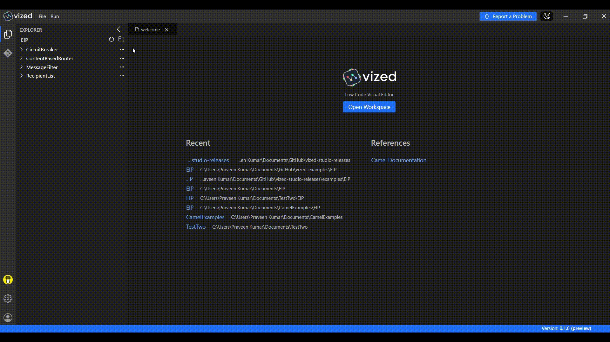
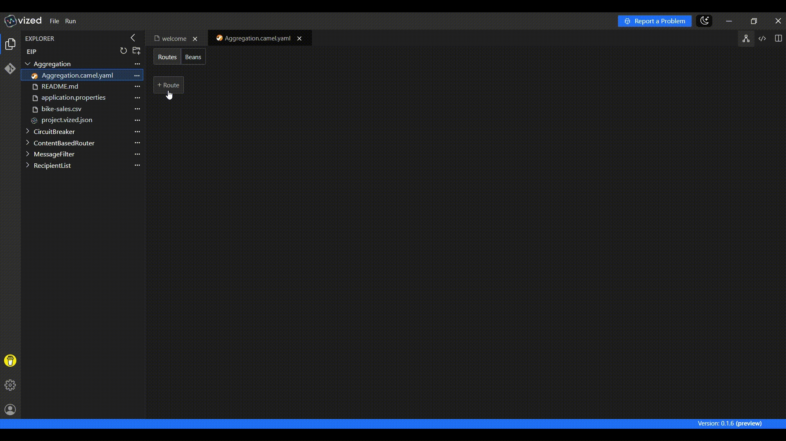

# Aggregation with VIZED & Apache Camel

## What is Aggregation?

Aggregation is an Enterprise Integration Pattern (EIP) that combines multiple messages into a single, cohesive message. This pattern is particularly useful when processing data in batches or when consolidating information from multiple sources into a unified format.

## Overview

This tutorial demonstrates how to implement **Aggregation** using **VIZED** and **Apache Camel**. You'll learn how to process a CSV file containing sales data, split it into individual records, and aggregate the data based on a specific field (e.g., bike model) to generate a summary report.

## Key Features

- **CSV File Processing**: Read and parse CSV files with ease.
- **Message Splitting**: Process each record in the file individually.
- **Data Aggregation**: Combine records based on a correlation key.
- **Dynamic File Writing**: Output aggregated results to a CSV file.

## Step-by-Step Implementation Guide

### 1. Create a New Integration Project

Begin by setting up your project workspace in VIZED:

1. Navigate to the Workspace view.
2. Create a new Integration Project for your routing solution.

### 2. Configure Your Source Component

Set up the entry point for your integration flow:

1. Click the "Add Route" button in the visual designer.
2. Search for the File Component in the Component tab.
3. Configure it to read a file named `bike-sales.csv`.

### 3. Parse and Split CSV Data

Convert the CSV content into a structured format and split it into individual records:

1. Add an Unmarshal processor and configure it to parse CSV data.
2. Set the delimiter to `,` and enable options like `useMaps` and `skipHeaderRecord`.
3. Add a Split processor to process each record individually.

### 4. Set Headers and Log Messages

Enhance your route with dynamic headers and logging:

1. Add a Set Header processor to extract the bike model from each record and store it in a header named `BikeModel`.
2. Add a Log processor to log the processing of each bike model.

### 5. Implement Aggregation Logic

Aggregate the records based on the bike model:

1. Add an Aggregate processor to group records by the `bike_id` field.
2. Configure the aggregation strategy to use `GroupedBodyAggregationStrategy`.
3. Add a Set Body processor to format the aggregated data as CSV.
4. Add a To processor to write the aggregated results to a file named `sales_report.csv`.

## Running the Integration Project

1. Select your integration project in VIZED.
2. Right-click on the Camel file and select "Run" from the context menu.
3. View the generated report in the reports folder.

<!-- ## Advanced Debugging Capabilities

### Step-by-Step Debugging

Debug your routes with precision using VIZED's integrated debugging tools:

1. Right-click the Camel file in your project.
2. Choose **Debug** from the context menu.
3. When the terminal opens, switch to the **Debug** tab.
4. Step through your route, inspect message values, and troubleshoot logic in real time.

 -->

## Need Help?

We're here to assist you with any questions or issues you may face. Whether you're stuck, confused, or simply need some guidance, we're just a click away!

> **Oops! Bugs happen.** Let us know so we can resolve them quickly. Your feedback is invaluable in helping us improve.

For more examples >> [click here](/examples/README.md)

## Contact us

  
  

