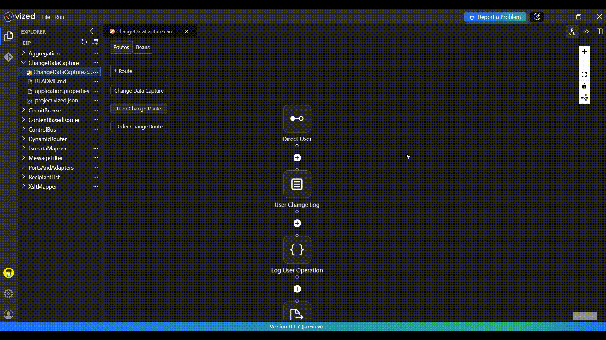

# Change Data Capture (CDC) with VIZED & Apache Camel

## What is Change Data Capture?

Change Data Capture (CDC) is an Enterprise Integration Pattern that enables real-time monitoring and capturing of changes made to a database. It allows applications to react to data modifications (inserts, updates, deletes) as they happen, enabling event-driven architectures and real-time data synchronization.

## Overview

This tutorial demonstrates how to implement **Change Data Capture** using **VIZED** and **Apache Camel**. You'll learn how to monitor MySQL database changes in real-time using Debezium, process different types of database operations, and route them to appropriate handlers based on the affected table.

## Key Features

- **Real-time Database Monitoring**: Capture changes as they happen in MySQL database.
- **Multi-table Support**: Monitor multiple tables (users, orders) simultaneously.
- **Operation-based Processing**: Handle CREATE, UPDATE, and DELETE operations differently.
- **Event Enrichment**: Add metadata and processing timestamps to captured events.
- **Table-based Routing**: Route events to specific processors based on the source table.

## System Architecture

The solution uses Apache Camel's integration framework with the following components:

```
┌─────────────────┐    ┌─────────────────┐    ┌─────────────────┐
│   MySQL DB      │───▶│ Debezium CDC    │───▶│ Event Processor │
│ (users, orders) │    │ Connector       │    │ (Enrichment)    │
└─────────────────┘    └─────────────────┘    └─────────────────┘
                                                        │
                                                        ▼
                                               ┌─────────────────┐
                                               │ Content-Based   │
                                               │ Router          │
                                               └─────────────────┘
                                                        │
                                    ┌───────────────────┼───────────────────┐
                                    ▼                   ▼                   ▼
                           ┌─────────────────┐ ┌─────────────────┐ ┌─────────────────┐
                           │ User Changes    │ │ Order Changes   │ │ Other Tables    │
                           │ Processor       │ │ Processor       │ │ (Logged)        │
                           └─────────────────┘ └─────────────────┘ └─────────────────┘
```

## Step-by-Step Implementation Guide

### 1. Create a New Integration Project

Begin by setting up your project workspace in VIZED:

1. Navigate to the Workspace view.
2. Create a new Integration Project for your CDC solution.

### 2. Configure Your CDC Source Component

Set up the Debezium MySQL connector to monitor database changes:

1. Click the "Add Route" button in the visual designer.
2. Search for the Debezium MySQL Component in the Component tab.
3. Configure it with your MySQL database connection details:
   - Database hostname and port
   - Database credentials
   - Tables to monitor (users, orders)
   - Offset storage configuration


### 3. Configure Content-Based Routing

Route events based on the source table:

1. Add a Script processor (Groovy) to:
   - Extract operation type (CREATE, UPDATE, DELETE)
   - Enrich with source metadata
2. Add a Choice processor to examine the table name.
3. Configure routing conditions:
   - Route `users` table changes to `direct:process-user-changes`
   - Route `orders` table changes to `direct:process-order-changes`
   - Log unhandled tables in the otherwise clause


### 4. Implement Table-Specific Route

Create route for each table:

1. **User Changes Route**:
   - Handle user creation, updates, and deletions
   - Log user-specific information
   - Save processed events to file

   

2. **Order Changes Route**:
   - Handle order lifecycle events
   - Process order status changes
   - Save processed events to file

   

## Running the Integration Project

1. Select your integration project in VIZED.
2. Right-click on the Camel file and select "Run" from the context menu.
3. Monitor the logs to see CDC events being captured and processed in real-time.
4. Check the output files in `/tmp/cdc-output/` for processed events.


## External Dependencies Setup

### 1. MySQL Database Setup

To capture database changes, you need to configure MySQL for CDC:

1. **Enable Binary Logging**:
   ```sql
   -- Add to my.cnf or my.ini
   [mysqld]
   log-bin=mysql-bin
   binlog-format=ROW
   binlog-row-image=FULL
   server-id=1
   ```

2. **Create Debezium User**:
   ```sql
   CREATE USER 'debezium_user'@'%' IDENTIFIED BY 'password';
   GRANT SELECT, RELOAD, SHOW DATABASES, REPLICATION SLAVE, REPLICATION CLIENT ON *.* TO 'debezium_user'@'%';
   FLUSH PRIVILEGES;
   ```

3. **Create Sample Tables**:
   ```sql
   CREATE DATABASE testdb;
   USE testdb;
   
   CREATE TABLE users (
       id INT AUTO_INCREMENT PRIMARY KEY,
       name VARCHAR(100),
       email VARCHAR(100),
       created_at TIMESTAMP DEFAULT CURRENT_TIMESTAMP
   );
   
   CREATE TABLE orders (
       id INT AUTO_INCREMENT PRIMARY KEY,
       user_id INT,
       status VARCHAR(50),
       total DECIMAL(10,2),
       created_at TIMESTAMP DEFAULT CURRENT_TIMESTAMP,
       FOREIGN KEY (user_id) REFERENCES users(id)
   );
   ```


## Testing the CDC Implementation

```sql
-- Insert Events
INSERT INTO users (name, email) VALUES ('Test User', 'test@example.com');
INSERT INTO orders (order_number, user_id, total_amount, status) VALUES ('ORD-001', 1, 99.99, 'pending'),

-- Update Events
UPDATE users SET name = 'Updated Test User' WHERE email = 'test@example.com';
UPDATE orders SET status = 'delivered' WHERE order_number = 'ORD-003';

-- DELETE events
DELETE FROM users WHERE email = 'test@example.com';
DELETE FROM orders WHERE order_number = 'ORD-002';
```


## Need Help?

We're here to assist you with any questions or issues you may face. Whether you're stuck, confused, or simply need some guidance, we're just a click away!

[](https://github.com/vized-io/artifacts/issues/new/choose)
> **Oops! Bugs happen.** Let us know so we can resolve them quickly. Your feedback is invaluable in helping us improve.

For more examples >> [click here](/examples/README.md)

## Contact us

[](https://www.linkedin.com/company/vized-io/)  
[](https://calendly.com/vidhyasagar-jeevendran/30min)  

[](https://buymeacoffee.com/vidhyasagarj)