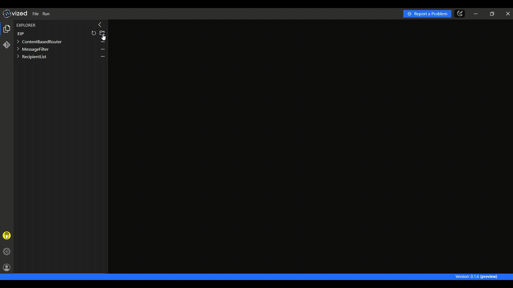
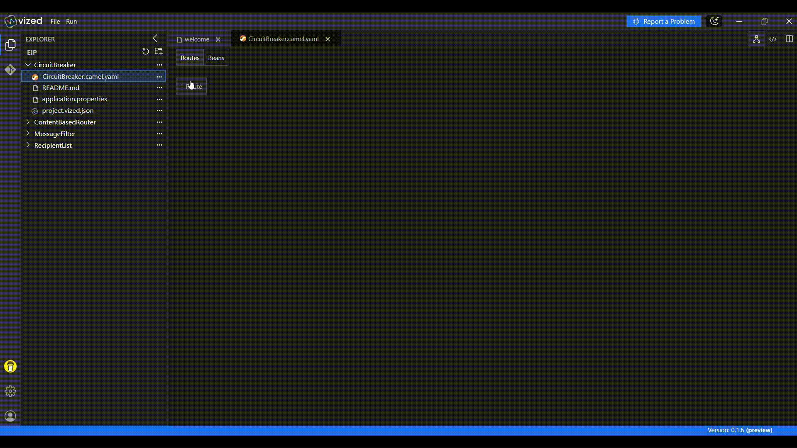

# Resilient API Integration with Circuit Breaker using VIZED & Apache Camel

## What is a Circuit Breaker?

The Circuit Breaker Enterprise Integration Pattern (EIP) is a resilience mechanism that prevents repeated failures from impacting your system. It monitors the success/failure rate of calls to external systems and halts execution temporarily if a failure threshold is reached — allowing your system to recover gracefully.

## Overview

In this tutorial, you’ll learn how to implement **Resilient API Calls** using the **Circuit Breaker** pattern via **VIZED** and **Apache Camel**. The integration periodically fetches inventory from an external vendor API, while gracefully handling failures using **Resilience4j**-based Circuit Breaker settings.

## Key Features

- **Timer-Driven Execution**: Trigger the API fetch at regular intervals
- **Circuit Breaker Protection**: Avoid repeated failures by automatically pausing calls when the external system is unstable
- **Fallback Handling**: Log custom messages when the API is unavailable
- **Resilience4j Configuration**: Customize thresholds, retries, and timeout durations

## Step-by-Step Implementation Guide

### 1. Create a New Integration Project

Begin by setting up your project workspace in VIZED:

1. Navigate to the Workspace view
2. Create a new Integration Project for your routing solution

### 2. Add a Timer as a Trigger

Use a Timer component to trigger the integration periodically:

1. Click the "Add Route" button in the visual designer
2. Search for the Timer Component
3. Set the **period** to `10000` (10 seconds)

### 3. Implement the Circuit Breaker Logic

Implement the circuit breaker logic to your route:

1. Add the Circuit Breaker processor
2. Inside the breaker:
    - Add a Logger to indicate the start of the fetch attempt
    - Add a REST Call to the vendor API
    - Add another Logger to display the response
3. Configure fallback to handle failure gracefully.

## Monitoring Your Integration in Real-Time

VIZED provides powerful tools to observe your integration as it runs:

### Using Topology View

Monitor your integration visually with VIZED's Topology View:

1. Select your integration project in VIZED
2. Right-click on the Camel file and select "Run" from the context menu
3. When the integration is running, click "View Monitoring"
4. For successful API calls, the circuit breaker allows the request and logs the inventory response.
5. Temporarily disable the api.
6. For failed API calls, the circuit breaker detects the failure and triggers the fallback route

## Advanced Debugging Capabilities

### Debugging Successfull Circuit Breaker

Debug your routes with precision using VIZED's integrated debugging tools:

1. Right-click the Camel file and Choose **Debug**.
2. When the terminal opens, switch to the **Debug** tab.
3. Step through your route, in Circuit Breaker the API call completes successfully and logs the response.
4. The fallback route is not triggered, indicating normal execution

### Debugging Fallback Circuit Breaker

Disable the backend api to trigger fallback mechanism:

1. Temporarily disable vendor API.
1. Right-click the Camel file and Choose **Debug**.
2. When the terminal opens, switch to the **Debug** tab.
3. Step through your route, in Circuit Breaker the api call will fail.
4. The fallback mechanism is executed, providing a graceful degradation of service.

## Need Help?

We're here to assist you with any questions or issues you may face. Whether you're stuck, confused, or simply need some guidance, we're just a click away! 

> **Oops! Bugs happen.** Let us know so we can resolve them quickly. Your feedback is invaluable in helping us improve.

For more examples >> [click here](/examples/README.md)

## Contact us

 
 

