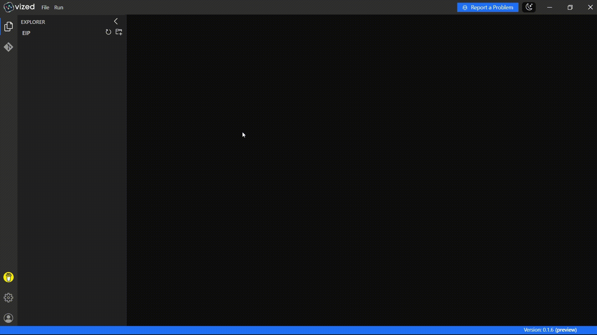
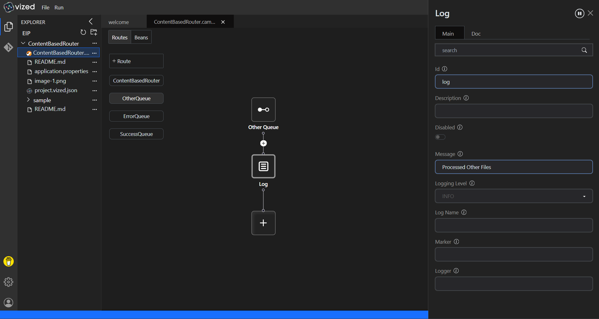
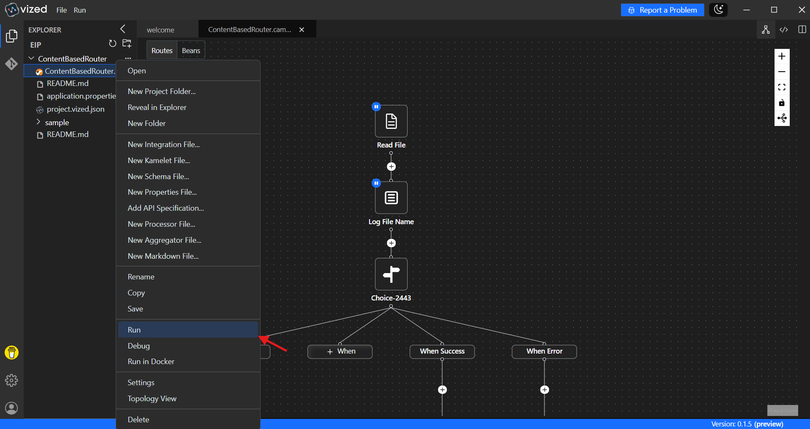
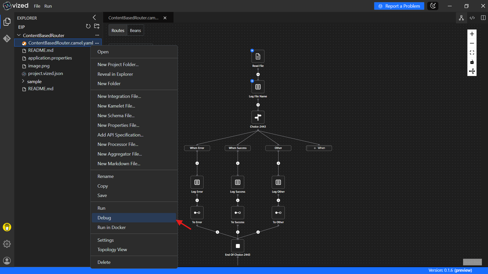

# Content-Based Routing with VIZED & Apache Camel

## What is Content-Based Routing?

Content-Based Routing is a powerful integration pattern that examines message content and routes each message to the appropriate destination based on its data. This pattern is essential for building flexible, data-driven integration flows that can handle diverse business requirements.

## Overview

This tutorial demonstrates how to implement **Content-Based Routing** using **VIZED** and **Apache Camel**. You'll learn how to create a routing system that inspects incoming messages and dynamically directs them to appropriate destinations based on message content.

## Key Features

- **Intelligent Message Routing**: Automatically routing messages based on keywoards to appropriate destinations
- **File-Based Integration**: Use Apache Camel's file component to process incoming data files

## Step-by-Step Implementation Guide

### 1. Create a New Integration Project

Begin by setting up your project workspace in VIZED:

1. Navigate to the Workspace view
2. Create a new Integration Project for your routing solution

### 2. Configure Your Source Component

Set up the entry point for your integration flow:

1. Click the "Add Route" button in the visual designer
2. Search for the File Component in the Component tab
3. Add it to your canvas as the starting point of your route

### 3. Implement the Content-Based Router

Add the decision-making logic to your route:

1. Add the Choice processor to your canvas
2. Configure multiple routing conditions based on message content
3. For each condition, add a Direct component to define different message destinations

### 4. Create Destination Routes

Set up the target routes for your messages:

1. Create three distinct routes to handle different message types:
   - ErrorQueue: For messages containing error information
   - SuccessQueue: For successful transaction messages
   - OtherQueue: For all other message types

### 5. Add Logging for Visibility

Enhance your route with logging capabilities:

1. Add Log Processor components to each destination route
2. Configure logging to record message details and processing status

## Monitoring Your Integration in Real-Time

VIZED provides powerful tools to observe your integration as it runs:

### Using Topology View

Monitor your integration visually with VIZED's Topology View:

1. Select your integration project in VIZED
2. Right-click on the Camel file and select "Run" from the context menu

3. When the integration is running, click "View Monitoring"
4. Watch as each component in the topology view displays real-time execution counts

## Advanced Debugging Capabilities

### Step-by-Step Debugging

Debug your routes with precision using VIZED's integrated debugging tools:

1. Right-click the Camel file in your project
2. Choose **Debug** from the context menu

3. When the terminal opens, switch to the **Debug** tab
4. Step through your route, inspect message values, and troubleshoot logic in real time

## Need Help?

We're here to assist you with any questions or issues you may face. Whether you're stuck, confused, or simply need some guidance, we're just a click away! 

> **Oops! Bugs happen.** Let us know so we can resolve them quickly. Your feedback is invaluable in helping us improve.

#### Contact us

 
 

