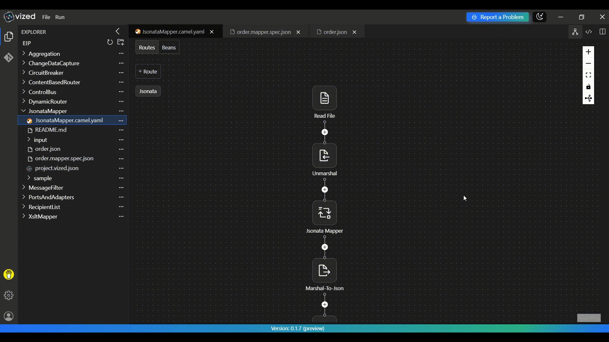
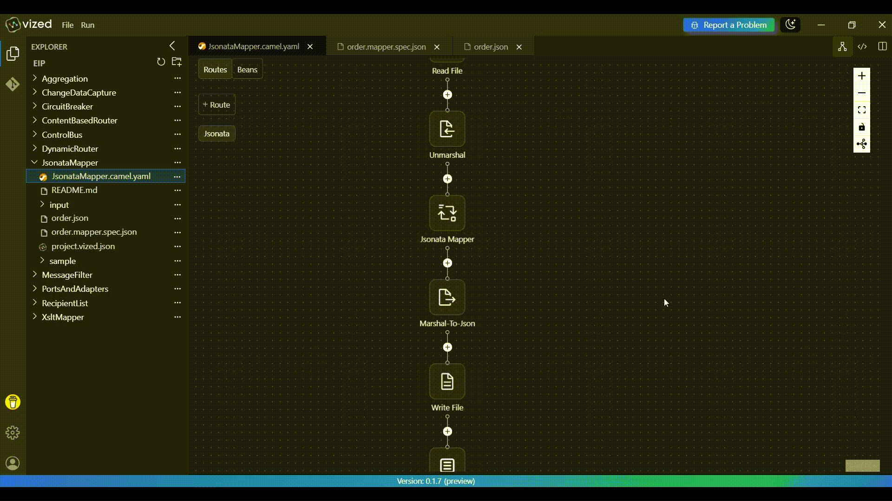

# JSONata Mapper with VIZED & Apache Camel

## What is JSONata Mapping?

JSONata Mapping is a powerful way to transform JSON data using declarative expressions. It enables developers to define complex mappings and transformations in a concise and readable format, making it ideal for data integration workflows.

## Overview

This tutorial demonstrates how to implement **JSONata Mapping** using **VIZED** and **Apache Camel**. You'll learn how to create a system that processes incoming JSON data, applies JSONata expressions for transformation, and routes the transformed data to the desired destination.

## Key Features

- **Declarative Mapping**: Use JSONata expressions to define transformations.
- **Dynamic Data Processing**: Handle complex JSON structures with ease.
- **Integration with Apache Camel**: Seamlessly integrate JSONata transformations into Camel routes.
- **Logging**: Monitor the transformation process for debugging and auditing.

## How to use Vized Jsonata Mapper

1. Open Context Menu of your desired project
2. Click New mapper file
3. Fill all the fields in the modal. For mapping type select jsonata.
4. Select source file, target file and create the document. 
5. Jsonata Mapper will open.
6. Map your desired source fields to target fields.

## Step-by-Step Implementation Guide

### 1. Create a New Integration Project

Begin by setting up your project workspace in VIZED:

1. Navigate to the Workspace view.
2. Create a new Integration Project for your mapping solution.

### 2. Configure Your Source Component

Set up the entry point for your integration flow:

1. Click the "Add Route" button in the visual designer.
2. Search for the File Component in the Component tab.
3. Configure it to read a JSON file named `input.json` from the root directory.

### 3. Apply JSONata Transformation

Use JSONata to transform the incoming JSON data:

1. Add Jsonata component.
2. Configure the resource uri to your preferred jsonata file

## Running the Integration Project

1. Select your integration project in VIZED.
2. Right-click on the Camel file and select "Run" from the context menu.
3. Send file using `Send Message` in vized terminal.
4. Go to project workspace and open `output.json` to view the transformed data.

## Need Help?

We're here to assist you with any questions or issues you may face. Whether you're stuck, confused, or simply need some guidance, we're just a click away!

> **Oops! Bugs happen.** Let us know so we can resolve them quickly. Your feedback is invaluable in helping us improve.

For more examples >> [click here](/examples/README.md)

## Contact us

  
  

