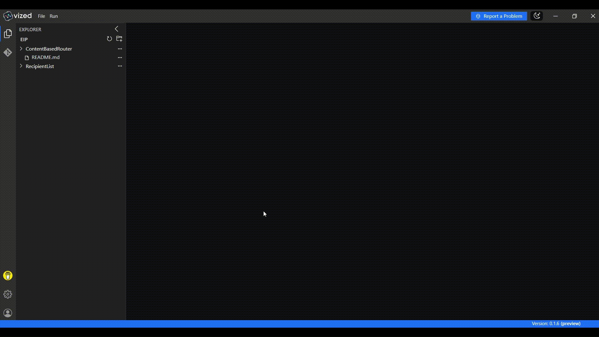
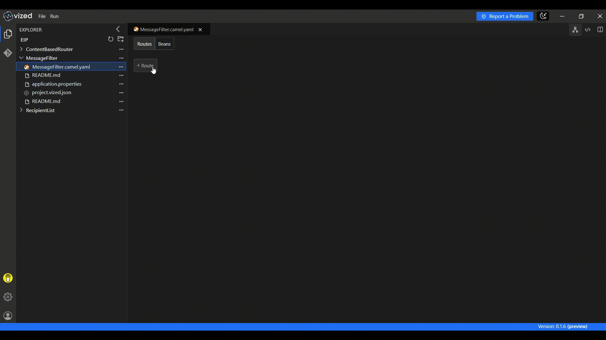
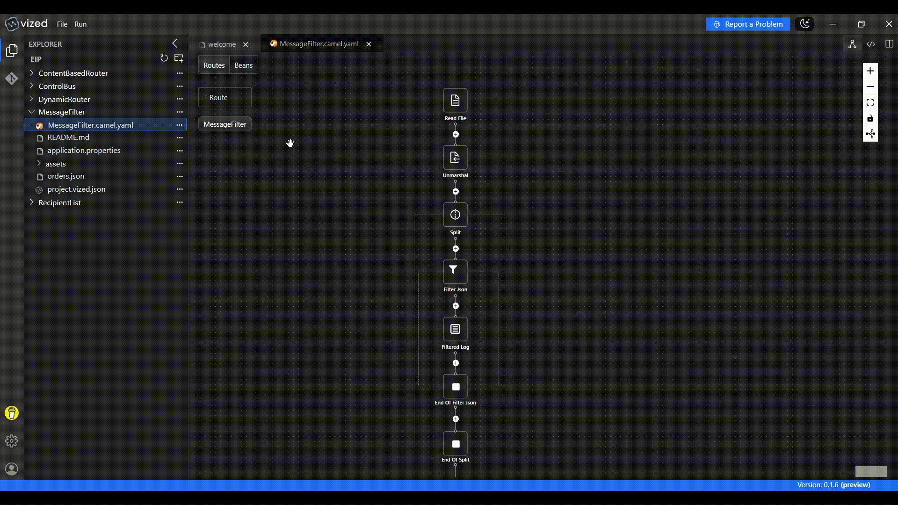

# Messaage Filtering with VIZED & Apache Camel

## What is Messaage Filter?

Messaage Filter is an Enterprise Integration Pattern (EIP) that allows you to process only those messages that meet specific conditions—ensuring your system only handles relevant or important data.

## Overview

This tutorial demonstrates how to implement **Messaage Filtering** using **VIZED** and **Apache Camel**. You'll build a route that reads a JSON file containing multiple orders, splits them, and filters only the high-value orders for further processing. 

## Key Features

- **JSON Processing**: Parses structured data from a JSON file.
- **Message Splitting**: Iterates through an array of records (orders).
- **Dynamic Filtering**: Filters only those records with orderValue > 1000.

## Step-by-Step Implementation Guide

### 1. Create a New Integration Project

Begin by setting up your project workspace in VIZED:

1. Navigate to the Workspace view
2. Create a new Integration Project for your routing solution

### 2. Configure Your Source Component

Set up the entry point for your integration flow:

1. Click the "Add Route" button in the visual designer
2. Search for the File Component in the Component tab
3. Configure it to read orders.json from the root directory.

### 3. Parse and Split JSON Orders

Convert JSON content into Java objects and split the list of orders into individual messages.

1. Use the Jackson library to handle JSON deserialization.
2. Ensure the entire JSON body is parsed into an iterable structure.
3. Add the Split processor.
4. Use ${body} to split over each order object in the array.

### 4. Filter High-Value Orders

Apply business logic to filter only those orders with a value greater than 1000:

1. Add the Filter processor.
2. Apply a simple expression ${body['orderValue']} > 1000.
3. Attach a Log processor inside the filter to log full order object.

## Running the Integration Project

1. Select your integration project in VIZED
2. Right-click on the Camel file and select "Run" from the context menu
3. Terminal will open showing the logs in application logs tab.

<!-- ## Advanced Debugging Capabilities

### Step-by-Step Debugging

Debug your routes with precision using VIZED's integrated debugging tools:

1. Right-click the Camel file in your project
2. Choose **Debug** from the context menu

3. When the terminal opens, switch to the **Debug** tab
4. Step through your route, inspect message values, and troubleshoot logic in real time

 -->

## Need Help?

We're here to assist you with any questions or issues you may face. Whether you're stuck, confused, or simply need some guidance, we're just a click away! 

> **Oops! Bugs happen.** Let us know so we can resolve them quickly. Your feedback is invaluable in helping us improve.

For more examples >> [click here](/examples/README.md)

## Contact us

 
 

