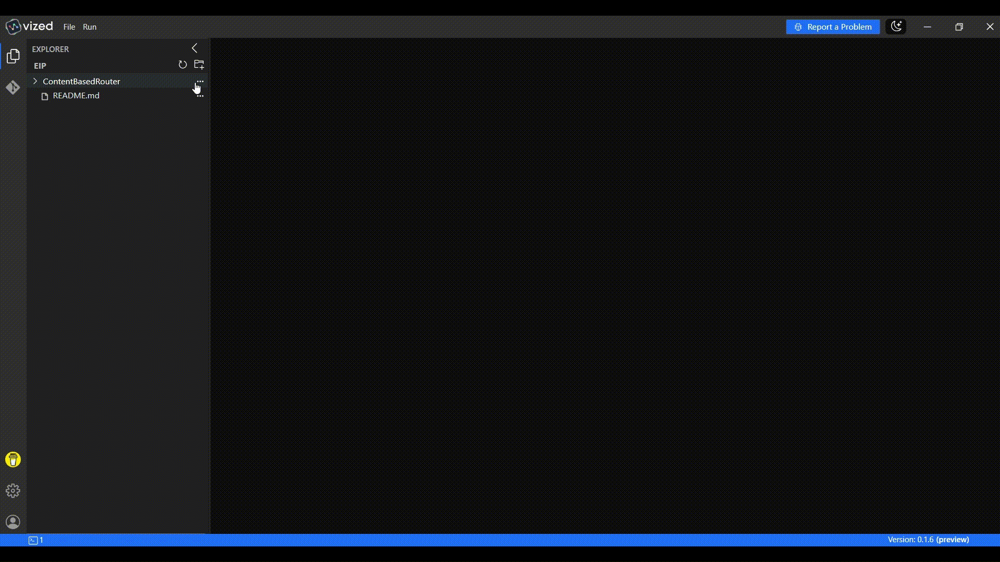
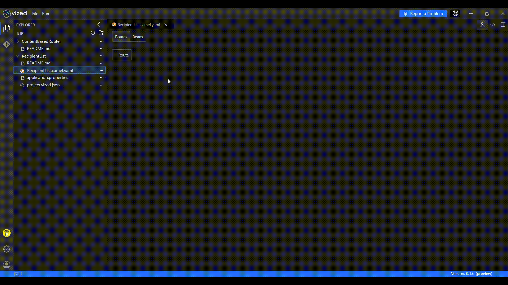
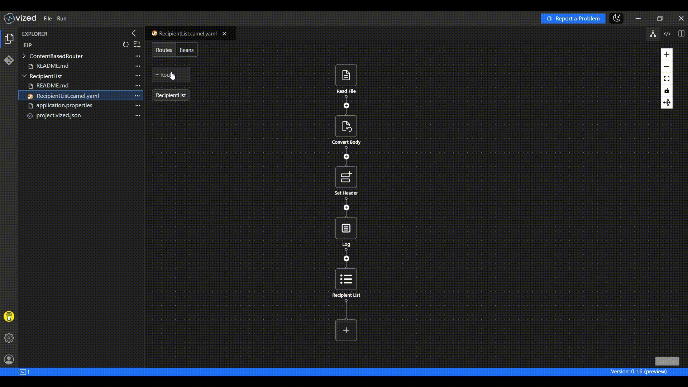
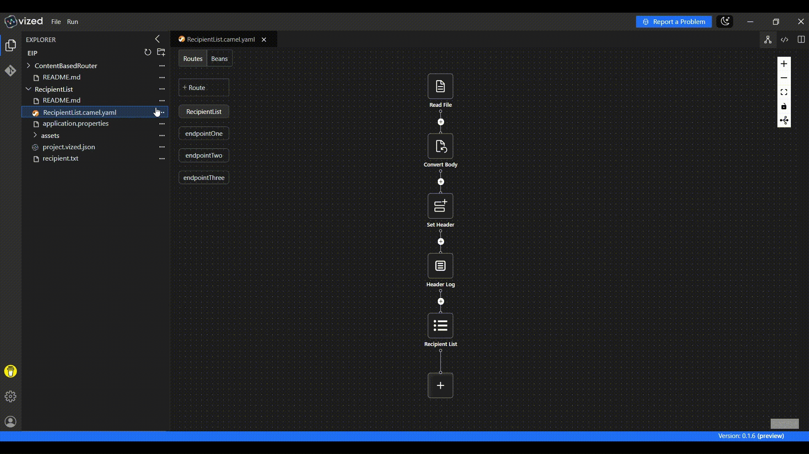

# Recipient List with VIZED & Apache Camel

## What is Recipient List Routing?

Recipient List is an Enterprise Integration Pattern (EIP) where a single message is forwarded to multiple recipients based on dynamic or static routing logic. This enables flexible broadcasting of messages to one or more target endpoints.

## Overview

This tutorial demonstrates how to implement **Recipient List** using **VIZED** and **Apache Camel**. You'll learn how to create a routing system that inspect an incoming message, determine the list of desired recipients, and forward the message to all channels associated with the recipients in the list.

## Key Features

- **Dynamic Routing**: Route messages to multiple recipients based on file content.
- **File-Based Integration**: Use Apache Camel's file component to read destination route.
- **Flexible Message Distribution**: Targets can be easily configured without changing route logic.

## Step-by-Step Implementation Guide

### 1. Create a New Integration Project

Begin by setting up your project workspace in VIZED:

1. Navigate to the Workspace view
2. Create a new Integration Project for your routing solution

### 2. Configure Your Source Component

Set up the entry point for your integration flow:

1. Click the "Add Route" button in the visual designer
2. Search for the File Component in the Component tab
3. Add it to your canvas as the starting point of your route.
4. Configure it to read a file named recipient.txt from the root directory.

### 3. Implement Recipient List

Define the routing logic dynamically based on file content:

1. Add a Convert Body To processor and set the type as String.
2. Add a Set Header processor to store file content in a header named RecipientListHeader.
3. Add a Recipient List processor and configure it to use ${header.RecipientListHeader}.

### 4. Create Recipient Endpoints

Set up the recipients endpoint for your messages:

1. Create three new routes:
   - Endpoint-1
   - Endpoint-2
   - Endpoint-3
2. In each route, add a Log processor to confirm message receipt.

## Running the Integration Project

1. Select your integration project in VIZED
2. Right-click on the Camel file and select "Run" from the context menu
3. Terminal will open showing the logs in application logs tab.

<!-- ## Advanced Debugging Capabilities

### Step-by-Step Debugging

Debug your routes with precision using VIZED's integrated debugging tools:

1. Right-click the Camel file in your project
2. Choose **Debug** from the context menu

3. When the terminal opens, switch to the **Debug** tab
4. Step through your route, inspect message values, and troubleshoot logic in real time

 -->

## Need Help?

We're here to assist you with any questions or issues you may face. Whether you're stuck, confused, or simply need some guidance, we're just a click away! 

> **Oops! Bugs happen.** Let us know so we can resolve them quickly. Your feedback is invaluable in helping us improve.

For more examples >> [click here](/examples/README.md)

## Contact us

 
 

