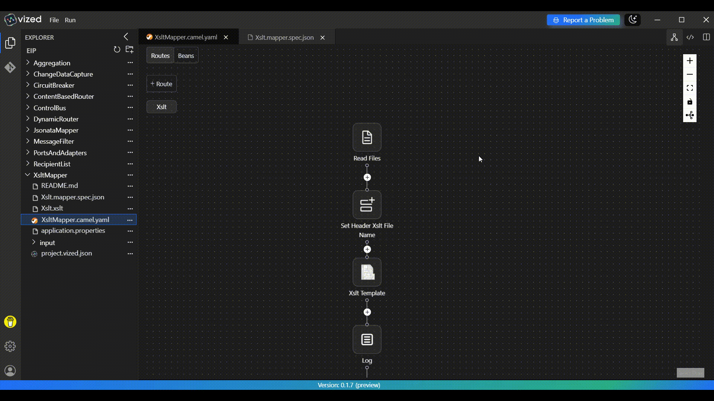
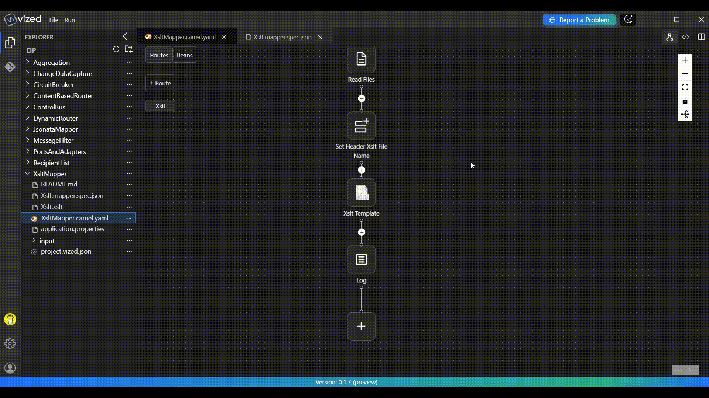

# XSLT Mapper with VIZED & Apache Camel

## What is XSLT Mapping?

XSLT (Extensible Stylesheet Language Transformations) is a language for transforming XML documents into other XML documents, HTML, or other formats. XSLT mapping allows you to convert XML data from one structure to another using transformation templates.

## Overview

This tutorial demonstrates how to implement **XSLT Transformation** using **VIZED** and **Apache Camel**. You'll learn how to create a system that monitors a directory for XML files, transforms them using XSLT templates, and outputs the transformed files to a destination directory.

## Key Features

- **File Monitoring**: Automatically processes XML files from an input directory
- **XSLT Transformation**: Transforms XML structure using XSLT templates
- **File Management**: Moves processed files to a "done" directory
- **Configurable Output**: Dynamically sets output file names
- **Comprehensive Logging**: Tracks transformation process for monitoring

## Step-by-Step Implementation Guide

### 1. Create a New Integration Project

Set up your project workspace in VIZED:

1. Navigate to the Workspace view.
2. Create a new Integration Project for your XSLT transformation solution.

### 2. Configure File Input

Set up the entry point for your integration flow:

1. Add a route to monitor the `input` directory for XML files.
2. Configure the route to move processed files to the `done` directory.



### 3. Apply XSLT Transformation

Transform XML files using XSLT templates:

1. Add an XSLT component to the route.
2. Configure the component to use the `Xslt.xslt` template.
3. Set dynamic headers for output file naming.
4. Add a logging component to track transformation results.



## Running the Integration

1. Select your integration project in VIZED
2. Place XML files in the `input` directory
3. Right-click on the Camel file and select "Run" from the context menu
4. Check the output.xml for transformed files


## Use Cases

This XSLT mapper pattern is ideal for:

- **Data Format Conversion**: Converting between different XML schemas
- **System Integration**: Transforming data between different systems
- **Legacy System Modernization**: Converting old XML formats to new structures
- **B2B Data Exchange**: Standardizing partner data formats
- **Configuration Transformation**: Converting configuration files between formats

<!-- ## Customization Options

### Dynamic File Naming
Modify the header expression to use dynamic naming:

```yaml
expression:
  simple: "transformed-${date:now:yyyyMMdd-HHmmss}.xml"
```

### Multiple XSLT Templates
Use content-based routing to apply different templates:

```yaml
- choice:
    when:
      - simple: "${header.CamelFileName} contains 'customer'"
        steps:
          - to: "xslt:classpath:customer-transform.xslt"
      - simple: "${header.CamelFileName} contains 'order'"
        steps:
          - to: "xslt:classpath:order-transform.xslt"
``` -->


## Need Help?

We're here to assist you with any questions or issues you may face. Whether you're stuck, confused, or simply need some guidance, we're just a click away!

[](https://github.com/vized-io/artifacts/issues/new/choose)

> **Oops! Bugs happen.** Let us know so we can resolve them quickly. Your feedback is invaluable in helping us improve.

For more examples >> [click here](/examples/README.md)

## Contact us

[](https://www.linkedin.com/company/vized-io/)
[](https://calendly.com/vidhyasagar-jeevendran/30min)

[](https://buymeacoffee.com/vidhyasagarj)